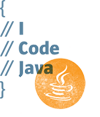
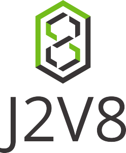

<p align="center">
    <a href="https://vuejs.org" target="_blank" rel="noopener noreferrer"></a>  
    &nbsp;&nbsp;&nbsp;&nbsp;
    <a href="https://www.oracle.com/technetwork/java/javase/downloads/index.html" target="_blank" rel="noopener noreferrer"></a>
    &nbsp;&nbsp;&nbsp;&nbsp;
    <a href="https://github.com/eclipsesource/J2V8" target="_blank" rel="noopener noreferrer"></a>
</p>

<p align="center">
  <a href="https://nodejs.org/"></a>
  <a href="https://www.npmjs.com/"></a>
  <a href="https://www.npmjs.com/package/vue"></a>
  <a href="https://www.oracle.com/technetwork/java/javase/downloads/index.html"></a>
  <a href="http://maven.apache.org/"></a>
  <a href="https://opensource.org/licenses/MIT"></a>
</p>

# Introduction
## jvue
Next light-weight,responsive project
With Vue,webpack,Spring Boot and eclipse j2v8 Script engine for server-side-rendering

## Note !!!

> j2v8 is not support promise on windows right now,
> so ``linux`` is prefered for production,windows support is on the way ...

# Build setup
1、Go to [webapp](src/main/webapp) and run vue ssr build

```bash
cd src/main/webapp && yarn && yarn build-ssr
```

# compile && run test

```bash
mvn -v && mvn compile && mvn exec:java
```

notice:You can run ``yarn build-ssr-dev`` in development mode to show error logs

2、Run java mavem build

```bash
mvn clean package -DskipTests
```

3、Copy ``target/ROOT.war`` to ``${TOMCAT_HOME}/webapps``

or

```bash
mvn clean spring-boot:run
```

# Structure

The whole project is a ``Java Spring Boot Maven`` structure,the ``src/main/webapp`` is a complete ``Vue`` Project With ``webpack`` structure

When build finish,all files merged into ``target/ROOT.war``

Have fun and enjoy!

# Contribute

You can contribute simplely by create a pull request for me

For detailed explanation on how things work, please visit [author's blog](http://www.terwergreen.com).